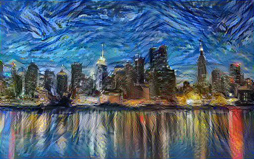
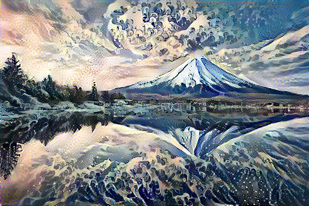

# Neural Style Transfer 🎨🧠

This project is part of the Prodigy InfoTech internship. It implements **Neural Style Transfer** using TensorFlow Hub on Google Colab.

## 📌 What is Neural Style Transfer?

NST is a technique that takes two images — a **content image** and a **style image** — and blends them together so that the output image looks like the content image painted in the style of the style image.

---

## 🧪 Experiments

### ✨ Style: Starry Night | Content: City Skyline

### 🌊 Style: The Great Wave | Content: Mt. Fuji

---

## 🛠 Tools & Libraries

- Python
- TensorFlow
- TensorFlow Hub
- Google Colab
- PIL
- NumPy

---

## 📁 Files

| File | Description |
|------|-------------|
| `colab_notebook.ipynb` | Google Colab notebook with code |
| `content.jpg` / `style.jpg` | Images used |
| `stylized_output.jpg` | Result after style transfer |

---

## 🤝 Credits

Internship project under **Prodigy InfoTech**  
Coded & debugged by: **Dharmit Shah**
